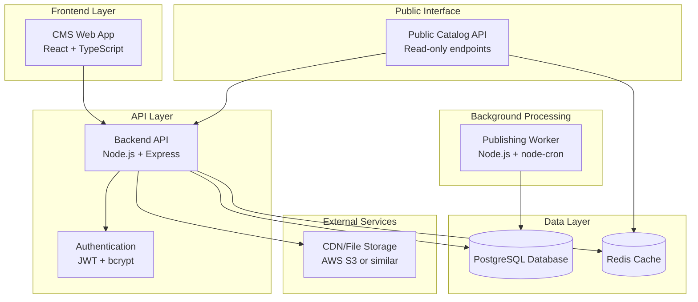

# Design Document

## Overview

The Admin CMS + Public Catalog system is designed as a modern, scalable web application with clear separation of concerns. The architecture follows a microservices-inspired approach with distinct components for the admin interface, public API, and background processing, all sharing a common database layer.

The system uses a PostgreSQL database for robust ACID compliance and excellent JSON support for multi-language content. The backend API is built with Node.js/Express for rapid development and excellent ecosystem support. The frontend uses React with TypeScript for type safety and modern UI patterns. Background processing is handled by a dedicated worker service using node-cron for scheduling.

## Architecture



### Technology Stack

**Backend:**
- Node.js 18+ with Express.js framework
- JavaScript ES6+ with JSDoc for documentation
- PostgreSQL 14+ for primary database
- Redis for caching and session storage
- Prisma ORM for database operations and migrations
- JWT for authentication
- bcrypt for password hashing
- node-cron for scheduled tasks
- Winston for structured logging

**Frontend:**
- React 18 with JavaScript
- Vite for build tooling
- React Router for navigation
- React Hook Form for form management
- Tailwind CSS for styling
- React Query for API state management
- Axios for HTTP requests

**Infrastructure:**
- Docker and Docker Compose for containerization
- Nginx for reverse proxy and static file serving
- Environment-based configuration
- Health check endpoints

## Components and Interfaces

### Database Schema

#### Core Entities

```sql
-- Programs table
CREATE TABLE programs (
    id UUID PRIMARY KEY DEFAULT gen_random_uuid(),
    title VARCHAR(255) NOT NULL,
    description TEXT,
    language_primary VARCHAR(10) NOT NULL,
    languages_available TEXT[] NOT NULL,
    status program_status NOT NULL DEFAULT 'draft',
    published_at TIMESTAMP,
    created_at TIMESTAMP DEFAULT NOW(),
    updated_at TIMESTAMP DEFAULT NOW(),
    
    CONSTRAINT programs_primary_in_available 
        CHECK (language_primary = ANY(languages_available))
);

-- Topics table
CREATE TABLE topics (
    id UUID PRIMARY KEY DEFAULT gen_random_uuid(),
    name VARCHAR(255) UNIQUE NOT NULL
);

-- Program-Topic junction table
CREATE TABLE program_topics (
    program_id UUID REFERENCES programs(id) ON DELETE CASCADE,
    topic_id UUID REFERENCES topics(id) ON DELETE CASCADE,
    PRIMARY KEY (program_id, topic_id)
);

-- Terms table
CREATE TABLE terms (
    id UUID PRIMARY KEY DEFAULT gen_random_uuid(),
    program_id UUID NOT NULL REFERENCES programs(id) ON DELETE CASCADE,
    term_number INTEGER NOT NULL,
    title VARCHAR(255),
    created_at TIMESTAMP DEFAULT NOW(),
    
    UNIQUE(program_id, term_number)
);

-- Lessons table
CREATE TABLE lessons (
    id UUID PRIMARY KEY DEFAULT gen_random_uuid(),
    term_id UUID NOT NULL REFERENCES terms(id) ON DELETE CASCADE,
    lesson_number INTEGER NOT NULL,
    title VARCHAR(255) NOT NULL,
    content_type content_type_enum NOT NULL,
    duration_ms INTEGER,
    is_paid BOOLEAN DEFAULT FALSE,
    content_language_primary VARCHAR(10) NOT NULL,
    content_languages_available TEXT[] NOT NULL,
    content_urls_by_language JSONB NOT NULL,
    subtitle_languages TEXT[],
    subtitle_urls_by_language JSONB,
    status lesson_status NOT NULL DEFAULT 'draft',
    publish_at TIMESTAMP,
    published_at TIMESTAMP,
    created_at TIMESTAMP DEFAULT NOW(),
    updated_at TIMESTAMP DEFAULT NOW(),
    
    UNIQUE(term_id, lesson_number),
    
    CONSTRAINT lessons_primary_in_available 
        CHECK (content_language_primary = ANY(content_languages_available)),
    CONSTRAINT lessons_scheduled_has_publish_at 
        CHECK (status != 'scheduled' OR publish_at IS NOT NULL),
    CONSTRAINT lessons_published_has_published_at 
        CHECK (status != 'published' OR published_at IS NOT NULL),
    CONSTRAINT lessons_video_has_duration 
        CHECK (content_type != 'video' OR duration_ms IS NOT NULL)
);
```

#### Asset Management Tables

```sql
-- Program assets (normalized approach)
CREATE TABLE program_assets (
    id UUID PRIMARY KEY DEFAULT gen_random_uuid(),
    program_id UUID NOT NULL REFERENCES programs(id) ON DELETE CASCADE,
    language VARCHAR(10) NOT NULL,
    variant asset_variant NOT NULL,
    asset_type program_asset_type NOT NULL,
    url VARCHAR(500) NOT NULL,
    
    UNIQUE(program_id, language, variant, asset_type)
);

-- Lesson assets (normalized approach)
CREATE TABLE lesson_assets (
    id UUID PRIMARY KEY DEFAULT gen_random_uuid(),
    lesson_id UUID NOT NULL REFERENCES lessons(id) ON DELETE CASCADE,
    language VARCHAR(10) NOT NULL,
    variant asset_variant NOT NULL,
    asset_type lesson_asset_type NOT NULL,
    url VARCHAR(500) NOT NULL,
    
    UNIQUE(lesson_id, language, variant, asset_type)
);
```

#### User Management

```sql
-- Users table
CREATE TABLE users (
    id UUID PRIMARY KEY DEFAULT gen_random_uuid(),
    email VARCHAR(255) UNIQUE NOT NULL,
    password_hash VARCHAR(255) NOT NULL,
    role user_role NOT NULL,
    created_at TIMESTAMP DEFAULT NOW(),
    updated_at TIMESTAMP DEFAULT NOW()
);
```

#### Enums

```sql
CREATE TYPE program_status AS ENUM ('draft', 'published', 'archived');
CREATE TYPE lesson_status AS ENUM ('draft', 'scheduled', 'published', 'archived');
CREATE TYPE content_type_enum AS ENUM ('video', 'article');
CREATE TYPE asset_variant AS ENUM ('portrait', 'landscape', 'square', 'banner');
CREATE TYPE program_asset_type AS ENUM ('poster');
CREATE TYPE lesson_asset_type AS ENUM ('thumbnail');
CREATE TYPE user_role AS ENUM ('admin', 'editor', 'viewer');
```

### API Design

#### Authentication Endpoints

```javascript
// POST /api/auth/login
// Request body:
// {
//   email: string,
//   password: string
// }

// Response:
// {
//   token: string,
//   user: {
//     id: string,
//     email: string,
//     role: 'admin' | 'editor' | 'viewer'
//   }
// }

// POST /api/auth/logout
// GET /api/auth/me
```

#### Admin API Endpoints

```typescript
// Programs
// GET /api/admin/programs?status=&language=&topic=&cursor=&limit=
// POST /api/admin/programs
// GET /api/admin/programs/:id
// PUT /api/admin/programs/:id
// DELETE /api/admin/programs/:id

// Terms
// GET /api/admin/programs/:programId/terms
// POST /api/admin/programs/:programId/terms
// PUT /api/admin/terms/:id
// DELETE /api/admin/terms/:id

// Lessons
// GET /api/admin/terms/:termId/lessons
// POST /api/admin/terms/:termId/lessons
// GET /api/admin/lessons/:id
// PUT /api/admin/lessons/:id
// DELETE /api/admin/lessons/:id
// POST /api/admin/lessons/:id/publish
// POST /api/admin/lessons/:id/schedule
// POST /api/admin/lessons/:id/archive

// Assets
// POST /api/admin/programs/:id/assets
// DELETE /api/admin/programs/:id/assets/:assetId
// POST /api/admin/lessons/:id/assets
// DELETE /api/admin/lessons/:id/assets/:assetId

// Topics
// GET /api/admin/topics
// POST /api/admin/topics
// PUT /api/admin/topics/:id
// DELETE /api/admin/topics/:id

// Users (Admin only)
// GET /api/admin/users
// POST /api/admin/users
// PUT /api/admin/users/:id
// DELETE /api/admin/users/:id
```

#### Public Catalog API

```javascript
// GET /catalog/programs?language=&topic=&cursor=&limit=
// Response format:
// {
//   programs: [{
//     id: string,
//     title: string,
//     description: string,
//     language_primary: string,
//     languages_available: string[],
//     published_at: string,
//     assets: {
//       posters: { [language]: { [variant]: string } }
//     },
//     topics: string[]
//   }],
//   pagination: {
//     cursor: string | null,
//     hasMore: boolean
//   }
// }

// GET /catalog/programs/:id
// Response includes full program with terms and published lessons

// GET /catalog/lessons/:id  
// Response includes complete lesson details with assets
```

### Frontend Component Architecture

```javascript
// Main App Structure
App
├── AuthProvider
├── Router
│   ├── PublicRoutes
│   │   └── LoginPage
│   └── ProtectedRoutes
│       ├── DashboardLayout
│       ├── ProgramsPage
│       │   ├── ProgramsList
│       │   ├── ProgramForm
│       │   └── AssetManager
│       ├── ProgramDetailPage
│       │   ├── TermsList
│       │   ├── LessonsList
│       │   └── LessonEditor
│       └── UsersPage (Admin only)

// Key Components with JSDoc documentation
/**
 * @param {Object} props
 * @param {Object} props.program - Program object
 * @param {Function} props.onSave - Save callback
 * @param {Function} props.onCancel - Cancel callback
 */
function ProgramForm({ program, onSave, onCancel }) {
  // Component implementation
}

/**
 * @param {Object} props
 * @param {string} props.entityId - Entity ID
 * @param {string} props.entityType - 'program' or 'lesson'
 * @param {string} props.language - Language code
 * @param {Function} props.onAssetsChange - Assets change callback
 */
function AssetManager({ entityId, entityType, language, onAssetsChange }) {
  // Component implementation
}
```

## Data Models

### Core Domain Models

```javascript
/**
 * Program model with JSDoc documentation
 * @typedef {Object} Program
 * @property {string} id - Unique identifier
 * @property {string} title - Program title
 * @property {string} [description] - Program description
 * @property {string} language_primary - Primary language code
 * @property {string[]} languages_available - Available languages
 * @property {'draft'|'published'|'archived'} status - Program status
 * @property {Date} [published_at] - Publication timestamp
 * @property {Date} created_at - Creation timestamp
 * @property {Date} updated_at - Update timestamp
 * @property {Topic[]} topics - Associated topics
 * @property {Term[]} terms - Program terms
 * @property {ProgramAsset[]} assets - Program assets
 */

/**
 * Term model
 * @typedef {Object} Term
 * @property {string} id - Unique identifier
 * @property {string} program_id - Parent program ID
 * @property {number} term_number - Term sequence number
 * @property {string} [title] - Term title
 * @property {Date} created_at - Creation timestamp
 * @property {Lesson[]} lessons - Term lessons
 */

/**
 * Lesson model
 * @typedef {Object} Lesson
 * @property {string} id - Unique identifier
 * @property {string} term_id - Parent term ID
 * @property {number} lesson_number - Lesson sequence number
 * @property {string} title - Lesson title
 * @property {'video'|'article'} content_type - Content type
 * @property {number} [duration_ms] - Duration in milliseconds
 * @property {boolean} is_paid - Whether lesson is paid
 * @property {string} content_language_primary - Primary content language
 * @property {string[]} content_languages_available - Available content languages
 * @property {Object} content_urls_by_language - Content URLs by language
 * @property {string[]} [subtitle_languages] - Subtitle languages
 * @property {Object} [subtitle_urls_by_language] - Subtitle URLs by language
 * @property {'draft'|'scheduled'|'published'|'archived'} status - Lesson status
 * @property {Date} [publish_at] - Scheduled publish time
 * @property {Date} [published_at] - Actual publish time
 * @property {Date} created_at - Creation timestamp
 * @property {Date} updated_at - Update timestamp
 * @property {LessonAsset[]} assets - Lesson assets
 */

/**
 * User model
 * @typedef {Object} User
 * @property {string} id - Unique identifier
 * @property {string} email - User email
 * @property {'admin'|'editor'|'viewer'} role - User role
 * @property {Date} created_at - Creation timestamp
 * @property {Date} updated_at - Update timestamp
 */
```

### Validation Models

```javascript
/**
 * Asset validation rules
 */
const AssetValidationRules = {
  program: {
    required_variants: ['portrait', 'landscape'],
    required_for_languages: ['primary']
  },
  lesson: {
    required_variants: ['portrait', 'landscape'],
    required_for_languages: ['content_primary']
  }
};

/**
 * Publishing validation service
 */
class PublishingValidation {
  /**
   * Validate lesson for publishing
   * @param {Lesson} lesson - Lesson to validate
   * @returns {Object} Validation result
   */
  validateLessonForPublishing(lesson) {
    // Implementation
  }

  /**
   * Validate program assets
   * @param {Program} program - Program to validate
   * @returns {Object} Validation result
   */
  validateProgramAssets(program) {
    // Implementation
  }
}
```

## Error Handling

### API Error Response Format

```javascript
/**
 * Standard API error response
 * @typedef {Object} APIError
 * @property {string} code - Error code
 * @property {string} message - Error message
 * @property {Object} [details] - Additional error details
 * @property {string} timestamp - Error timestamp
 * @property {string} requestId - Request correlation ID
 */

// Error Codes
const ErrorCodes = {
  VALIDATION_ERROR: 'VALIDATION_ERROR',
  AUTHENTICATION_FAILED: 'AUTHENTICATION_FAILED',
  AUTHORIZATION_FAILED: 'AUTHORIZATION_FAILED',
  RESOURCE_NOT_FOUND: 'RESOURCE_NOT_FOUND',
  DUPLICATE_RESOURCE: 'DUPLICATE_RESOURCE',
  PUBLISHING_VALIDATION_FAILED: 'PUBLISHING_VALIDATION_FAILED',
  ASSET_VALIDATION_FAILED: 'ASSET_VALIDATION_FAILED',
  DATABASE_ERROR: 'DATABASE_ERROR',
  INTERNAL_SERVER_ERROR: 'INTERNAL_SERVER_ERROR'
};
```

### Error Handling Strategy

1. **Input Validation**: Use Joi or Zod for request validation with detailed error messages
2. **Database Errors**: Catch constraint violations and provide user-friendly messages
3. **Authentication/Authorization**: Clear error messages without exposing security details
4. **Asset Validation**: Specific validation for required assets before publishing
5. **Worker Errors**: Comprehensive logging with retry mechanisms for transient failures

## Testing Strategy

### Backend Testing

```javascript
// Unit Tests
describe('LessonService', () => {
  describe('publishLesson', () => {
    it('should validate required assets before publishing');
    it('should update lesson status and published_at');
    it('should auto-publish parent program if needed');
    it('should handle concurrent publishing attempts');
  });
});

// Integration Tests
describe('Publishing Worker', () => {
  it('should process scheduled lessons correctly');
  it('should be idempotent when run multiple times');
  it('should handle database connection failures gracefully');
});

// API Tests
describe('Catalog API', () => {
  it('should return only published programs');
  it('should filter by language and topic correctly');
  it('should implement cursor-based pagination');
  it('should include proper cache headers');
});
```

### Frontend Testing

```javascript
// Component Tests
describe('LessonEditor', () => {
  it('should display validation errors for missing assets');
  it('should enable publish button only when validation passes');
  it('should handle scheduling with date picker');
});

// Integration Tests
describe('Publishing Flow', () => {
  it('should complete end-to-end lesson publishing');
  it('should handle asset upload and validation');
  it('should update UI after successful publishing');
});
```

### Database Testing

- Migration tests to ensure schema changes work correctly
- Constraint validation tests
- Index performance tests with sample data
- Concurrency tests for worker operations

## Performance Considerations

### Database Optimization

1. **Indexing Strategy**:
   ```sql
   -- Performance indexes
   CREATE INDEX idx_lessons_status_publish_at ON lessons(status, publish_at);
   CREATE INDEX idx_lessons_term_lesson_number ON lessons(term_id, lesson_number);
   CREATE INDEX idx_programs_status_language_published ON programs(status, language_primary, published_at);
   CREATE INDEX idx_program_topics_program_id ON program_topics(program_id);
   CREATE INDEX idx_program_topics_topic_id ON program_topics(topic_id);
   CREATE INDEX idx_program_assets_lookup ON program_assets(program_id, language, variant, asset_type);
   CREATE INDEX idx_lesson_assets_lookup ON lesson_assets(lesson_id, language, variant, asset_type);
   ```

2. **Query Optimization**:
   - Use prepared statements for repeated queries
   - Implement proper JOIN strategies for complex queries
   - Use EXPLAIN ANALYZE for query performance monitoring

### Caching Strategy

1. **Redis Caching**:
   - Cache catalog API responses with TTL
   - Cache user sessions and authentication tokens
   - Cache frequently accessed program/lesson data

2. **HTTP Caching**:
   - Set appropriate Cache-Control headers for catalog endpoints
   - Implement ETag support for conditional requests
   - Use CDN for static assets

### API Performance

1. **Pagination**: Cursor-based pagination for better performance on large datasets
2. **Field Selection**: Allow clients to specify required fields to reduce payload size
3. **Compression**: Enable gzip compression for API responses
4. **Rate Limiting**: Implement rate limiting to prevent abuse

## Security Considerations

### Authentication & Authorization

1. **JWT Implementation**:
   - Short-lived access tokens (15 minutes)
   - Refresh token rotation
   - Secure token storage practices

2. **Password Security**:
   - bcrypt with appropriate salt rounds (12+)
   - Password complexity requirements
   - Account lockout after failed attempts

3. **Role-Based Access Control**:
   - Middleware for route protection
   - Fine-grained permissions per endpoint
   - Audit logging for sensitive operations

### Data Protection

1. **Input Sanitization**: Prevent SQL injection and XSS attacks
2. **CORS Configuration**: Proper CORS setup for frontend-backend communication
3. **Environment Variables**: Secure handling of secrets and configuration
4. **HTTPS Enforcement**: SSL/TLS for all communications

### Asset Security

1. **File Upload Validation**: Validate file types, sizes, and content
2. **CDN Security**: Secure asset URLs with appropriate access controls
3. **Asset Cleanup**: Remove orphaned assets to prevent storage bloat